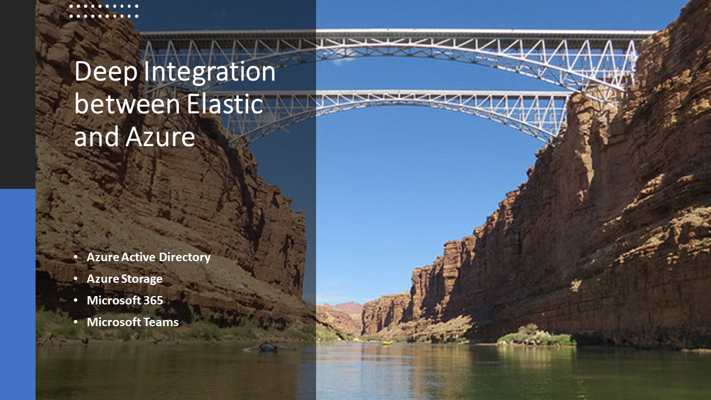

# Elastic On Microsoft Azure

## Helpful Resources

Public repository with resources to deployment strategies for deploying Elastic on Azure as well as integration points between the Elastic ecosystem as well as the Microsoft ecosystem of platform products.

## Speakers for Table Talk at Microsoft Build 2021

Please reach out [Phoebe Quincy](https://twitter.com/quincy_phoebe), [Israel Ekpo](https://twitter.com/izzyacademy) and [Eric Ooi](https://twitter.com/ericooi) if you have additional questions or feedback. Thanks.

## Why you need Elastic on Azure

By running Elastic Stack on Azure, you can take data from any source reliably and securely, in any format, then search, analyze, and visualize it in real time. Elastic can deliver sub-second response times when working at tera and petabyte scale on Azure.

With deployment models to meet your unique use case, you can quickly and easily gain speed, scale, and relevance. You benefit from frictionless integration that delivers faster time to market.

Open-source users must self-manage Elastic software and licensing. They have no access to Elasticsearch Service managed service features, or services like consultative tech support, training, and consulting services.

With Elastic Cloud (Elasticsearch managed service), you can use your Azure commitment to get the most out of your data and technology. Elastic covers the maintenance and upkeep so you can focus on innovation.

- **Search Use Cases**: You can ingest and transform data, deploy site crawlers, embed search in applications, and connect data silos for enterprise search.
Elastic provides you with the ability to infuse search experiences into your web applications or search for the apps you use at work.
- **Observability Use Cases**: Create observable systems by unifying logs, metrics, APM events, and traces. With Elastic you can use logs, metrics and APM data to monitor and react to events in your environment.
- **Security Use Cases**: Our users threat hunt and respond with SIEM and endpoint security. With Elastic on Azure you can prevent, detect and respond to threats with SIEM, endpoint security and threat hunting.
- **Location Based Applications**: Elastic on Azure simplifies the process for developing location-enabled applications that understand GeoJSON

## Deployment Strategies on Microsoft Azure

Below are resources to deployment strategies for setting up your Elastic infrastructure on Azure

### Elastic/Microsoft Azure Partnership
https://www.elastic.co/partners/microsoft-azure

### Deploying Elastic Cloud from Microsoft Azure Marketplace

https://www.elastic.co/campaigns/relevance-and-resilience-your-way

### Deploying Elastic Cloud on Microsoft Azure Kubernetes Service
https://www.elastic.co/guide/en/cloud-on-k8s/current/k8s-quickstart.html

### Deploying Elastic Cloud on Microsoft Azure Virtual Machines via Ansible
https://www.elastic.co/guide/en/cloud-enterprise/current/ece-installing.html

## Integration Points between Elastic, Azure and the Microsoft Ecosystem

These are documentation to resources on how to integrate the Elastic ecosystem with Microsoft platform products

### Integration with Microsoft Ecosystem
https://www.elastic.co/integrations?search=microsoft

### Integrations with Azure Ecosystem
https://www.elastic.co/integrations?search=azure

## Additional Integration Stories

### Azure Single Sign-on
https://www.elastic.co/blog/integrating-azure-single-sign-on-with-elastic-cloud-enterprise-at-strabag

### Kibana Integration with Microsoft Teams
https://www.elastic.co/guide/en/kibana/master/teams-action-type.html

### Integration with MSSQL
https://www.elastic.co/guide/en/beats/filebeat/current/filebeat-module-mssql.html

### Registered antivirus solution with Windows
https://www.elastic.co/blog/whats-new-elastic-security-7-11-0-cloud-host-detections-accessible-UI

## Planning your Elastic Deployment on Azure

You can use the link below to plan and estimate your Elastic deployment capacity and costs effectively.

https://cloud.elastic.co/pricing

## Reaching Out

Please reach out [Phoebe Quincy](https://twitter.com/quincy_phoebe), [Israel Ekpo](https://twitter.com/izzyacademy) and [Eric Ooi](https://twitter.com/ericooi) if you have additional questions or feedback. Thanks.